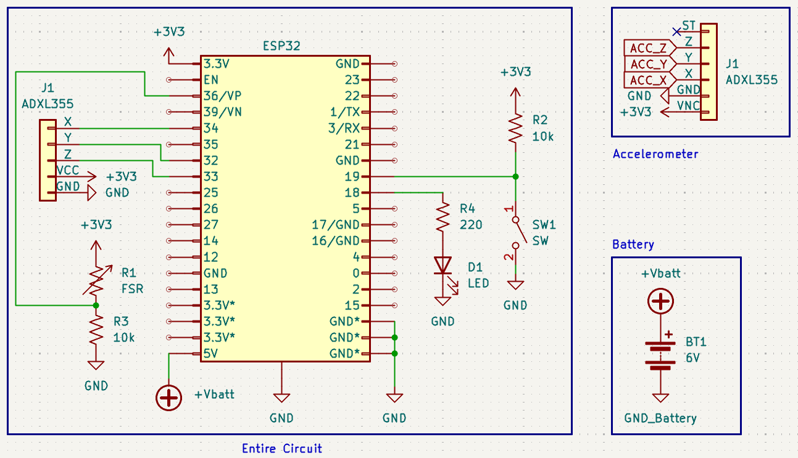

# Hardware

This folder contains hardware documentation for the CPR Trainer, including the KiCad schematic project and exported images used for demos.

## Contents

- `schematic.png` - exported circuit schematic preview
- KiCad project files - editable source files for wiring/schematic updates

## Notes

- The active firmware pin mapping is documented in `firmware/README.md`.
- Use this folder as the single source of truth for hardware wiring revisions.

